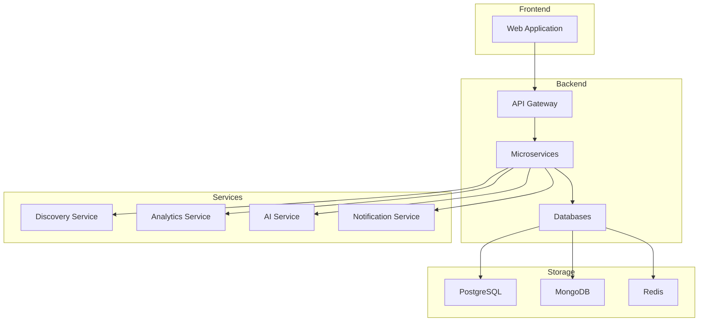

# SaaS Management Platform

[](https://github.com/your-org/saas-platform/actions)
[](https://codecov.io/gh/your-org/saas-platform)
[](LICENSE)
[](package.json)

Enterprise-grade SaaS Management Platform designed to help SMBs discover, track, and optimize their software subscriptions using AI-powered insights.

## Features

- 🔍 Automated SaaS discovery through payment and email analysis
- 📊 Real-time usage monitoring and analytics
- 💰 Cost optimization recommendations with 20-30% savings potential
- 🤖 AI-powered insights and recommendations
- 🔐 Enterprise-grade security with role-based access
- 📱 Responsive design for all devices

## Architecture



## Prerequisites

- Node.js >= 20.0.0 LTS
- Angular CLI 17.x
- Docker Desktop 24.x+
- Python 3.11+
- AWS CLI v2
- Terraform >= 1.5

## Quick Start

1. Clone the repository:
```bash
git clone https://github.com/your-org/saas-platform.git
cd saas-platform
```

2. Install dependencies:
```bash
./scripts/setup-env.sh
```

3. Start development environment:
```bash
docker-compose up
```

4. Access the application:
- Frontend: http://localhost:4200
- API: http://localhost:3000
- API Documentation: http://localhost:3000/api/docs

## Project Structure

```
├── src/
│   ├── web/                 # Angular frontend application
│   ├── backend/            # NestJS microservices
│   └── ai/                 # Python AI/ML services
├── infrastructure/         # Terraform IaC configurations
├── scripts/               # Development and deployment scripts
├── docs/                  # Documentation
└── tests/                # End-to-end tests
```

## Development

### Available Commands

```bash
# Start development environment
npm run start:dev

# Run tests
npm run test:all

# Build for production
npm run build:all

# Deploy to environment
./infrastructure/scripts/deploy.sh [env]

# Run linting
npm run lint:all
```

### Code Style

- Follow Angular style guide for frontend
- Follow NestJS best practices for backend
- Use TypeScript strict mode
- Implement SOLID principles
- Maintain minimum 80% test coverage

## Deployment

### Environment Configuration

- Development: Local Docker environment
- Staging: AWS US-East-2
- Production: AWS US-East-1 (Multi-AZ)
- DR: AWS US-West-2

### Infrastructure

- ECS Fargate for container orchestration
- RDS PostgreSQL for primary database
- DocumentDB for document storage
- ElastiCache Redis for caching
- CloudFront for content delivery
- AWS Shield & WAF for security

## Security

- Zero Trust security model
- JWT-based authentication
- OAuth2/OIDC integration
- Role-based access control
- Field-level encryption
- AWS KMS for key management

## Monitoring

- CloudWatch for AWS services
- Prometheus for metrics
- Grafana for visualization
- X-Ray for distributed tracing
- Custom alerting via PagerDuty

## Contributing

1. Create feature branch from `develop`
2. Implement changes with tests
3. Update documentation
4. Submit PR with description
5. Pass CI checks and code review
6. Squash and merge

## License

Copyright © 2024 Your Organization. All rights reserved.

## Support

For technical support or questions, contact: support@saasplatform.com