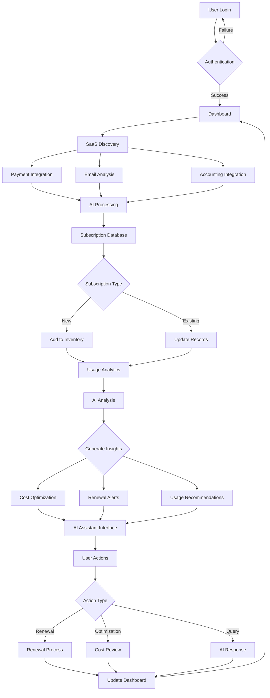
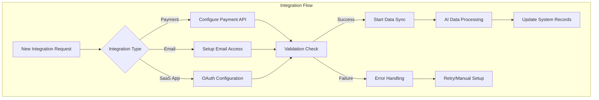
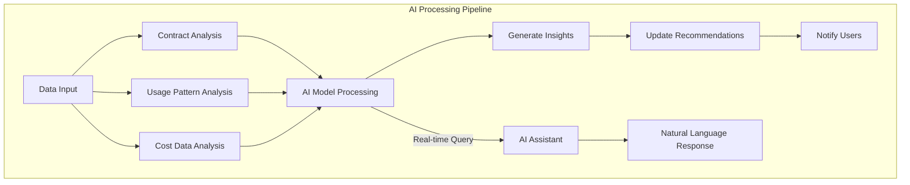
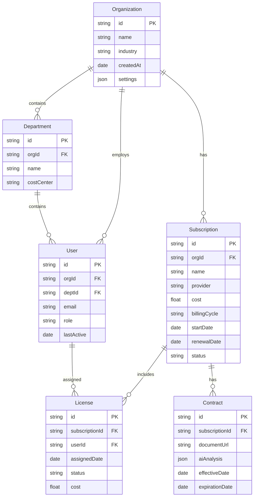
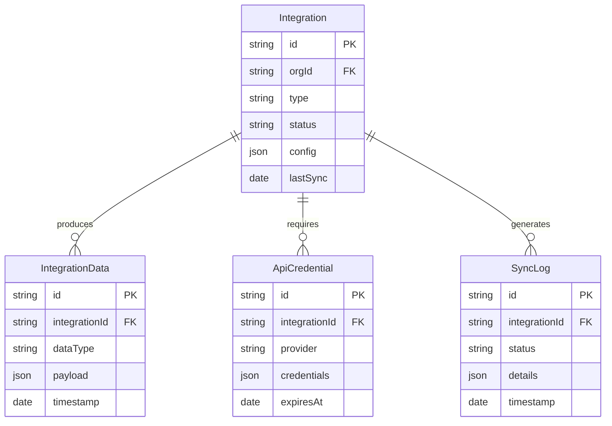

# Product Requirements Document (PRD)

# 1. INTRODUCTION

## 1.1 Purpose

This Software Requirements Specification (SRS) document provides a comprehensive description of the SaaS Management Platform designed for small to medium-sized businesses. It details the functional and non-functional requirements for developers, project managers, QA teams, and stakeholders involved in the development and implementation process.

## 1.2 Scope

The SaaS Management Platform is a web-based application built on Angular frontend and Node.js backend, deployed on AWS infrastructure. The system will:

- Automatically discover and track SaaS subscriptions through integrations with payment providers, accounting systems, and email services
- Leverage AI capabilities for contract analysis, usage insights, and intelligent recommendations
- Provide real-time monitoring of software usage and spend analytics
- Offer renewal management and cost optimization features
- Include a conversational AI assistant for instant insights and recommendations
- Support integration with various SaaS applications, starting with Google Workspace

Key benefits include:

- Centralized visibility into all SaaS applications
- Reduced software spend through optimization
- Prevention of redundant subscriptions
- Enhanced security and compliance management
- Data-driven decision making through AI-powered insights
- Automated contract and renewal management

The platform will initially focus on core subscription tracking and cost management features, with planned expansions to include advanced analytics, customizable dashboards, and subscription workflow management in future releases.

# 2. PRODUCT DESCRIPTION

## 2.1 Product Perspective

The SaaS Management Platform operates as a standalone web application while integrating with various external systems. The system architecture consists of:

- Angular-based web frontend accessible via modern browsers
- Node.js backend services deployed on AWS infrastructure
- Integration layers connecting to:
  - Payment processing systems (Stripe, PayPal)
  - Accounting platforms (QuickBooks, Xero)
  - Email services (Google Workspace, Microsoft 365)
  - Individual SaaS applications for usage data
- AI/ML services for contract analysis and insights generation
- Secure data storage for subscription and usage information

## 2.2 Product Functions

The platform provides the following core functions:

- Automated SaaS Discovery

  - Payment system integration to identify SaaS subscriptions based on transactions or vendor names
  - Email receipt analysis to identify SaaS subscriptions based on receipts or notifications from SaaS providers
  - AI-powered application identification to help understand whether payments and email data indicates the presence of a SaaS subscription and what the details of that subscription may be.

- Subscription Management

  - Centralized subscription tracking including a summary and list of SaaS subscriptions
  - Contract storage and analysis making it easy to understand and view the specifics of each subscription and service.
  - Renewal management to provide visibility into upcoming expirations, renewals and associated actions.
  - Cost allocation to be able to categorize expenses for financial planning and accounting

- Usage Analytics

  - Real-time usage monitoring to reveal which applications are used the most or have the greatest impact.
  - Utilization tracking to ensure paid licenses are all being used
  - Department-level analytics
  - Cost optimization recommendations

- AI-Powered Features

  - Conversational assistant with awareness of all relevant underlying SaaS subscription and usage data, as well as other relevant expertise.
  - Contract analysis that can extract relevant SaaS subscription details form a PDF invoice or email.
  - Usage pattern analysis based on spend data or deeper data from usage integrations.
  - Intelligent recommendations with awareness of all relevant underlying SaaS subscription and usage data, as well as other relevant expertise.
  - Spend analytics

## 2.3 User Characteristics

| User Type | Role Description | Technical Expertise | Primary Goals |
| --- | --- | --- | --- |
| IT Managers | Oversee software stack and security | High | Maintain visibility of all SaaS applications, ensure security compliance |
| Finance Teams | Monitor and optimize software spend | Medium | Track costs, identify savings opportunities, manage renewals |
| Department Heads | Manage team software access | Low-Medium | Monitor team usage, request new subscriptions |
| System Administrators | Platform configuration and maintenance | High | System setup, integration management, user access control |

## 2.4 Constraints

- Technical Constraints

  - Must operate within AWS infrastructure
  - Browser compatibility limited to modern versions of Chrome, Firefox, Safari, and Edge
  - API rate limits from integrated services
  - Real-time data processing capable of accommodating 50,000 subscriptions

- Security Constraints

  - Compliance with SOC 2, GDPR, and CCPA requirements
  - Mandatory encryption for data in transit and at rest
  - Multi-factor authentication requirement
  - Regular security audits

- Business Constraints

  - Initial focus on SMB market segment
  - Google Workspace as first supported integration
  - Budget limitations for third-party services
  - Time-to-market requirements

## 2.5 Assumptions and Dependencies

### Assumptions

- Users have administrative access to their organization's payment and accounting systems
- Target organizations use common SaaS applications
- Stable internet connectivity is available
- Users have modern web browsers
- Organizations maintain fairly accurate financial records despite sometimes failing to reconcile or categorize transactions.

### Dependencies

- Availability and stability of third-party APIs
- AWS service availability
- Continuous access to AI/ML services
- Regular updates from integrated payment systems
- Maintenance of provider databases for SaaS identification
- Reliable email service access for notification delivery

# 3. PROCESS FLOWCHART







# 4. FUNCTIONAL REQUIREMENTS

## 4.1 SaaS Discovery and Tracking

### ID: F001

### Description

Automated discovery and tracking of SaaS applications through integration with payment systems, accounting platforms, and email services.

### Priority: High

### Requirements

| ID | Requirement | Details |
| --- | --- | --- |
| F001.1 | Payment Integration | Connect with Stripe, PayPal APIs to monitor software purchases |
| F001.2 | Email Analysis | Parse email receipts and contracts using AI for subscription identification |
| F001.3 | Accounting Integration | Sync with QuickBooks, Xero for transaction monitoring |
| F001.4 | AI Classification | Automatically categorize and tag discovered applications |
| F001.5 | Manual Entry | Allow manual addition and editing of subscription details |

## 4.2 Subscription Management

### ID: F002

### Description

Centralized management of all SaaS subscriptions including contract storage, renewal tracking, and cost allocation.

### Priority: High

### Requirements

| ID | Requirement | Details |
| --- | --- | --- |
| F002.1 | Contract Storage | Secure storage and AI analysis of subscription contracts |
| F002.2 | Renewal Tracking | Automated notifications for upcoming renewals |
| F002.3 | Cost Allocation | Department and team-level cost assignment |
| F002.4 | License Management | Track and manage user licenses across applications |
| F002.5 | Ownership Assignment | Delegate subscription ownership to teams/individuals |

## 4.3 Usage Analytics

### ID: F003

### Description

Real-time monitoring and analysis of SaaS application usage patterns and costs.

### Priority: High

### Requirements

| ID | Requirement | Details |
| --- | --- | --- |
| F003.1 | Usage Monitoring | Real-time tracking of application utilization |
| F003.2 | Cost Analytics | Detailed spend analysis and trending |
| F003.3 | Optimization Detection | Identify underutilized or redundant subscriptions |
| F003.4 | Department Analytics | Usage metrics by team and department |
| F003.5 | Export Capabilities | Generate and export usage reports |

## 4.4 AI Assistant

### ID: F004

### Description

Conversational AI interface providing instant insights and recommendations.

### Priority: High

### Requirements

| ID | Requirement | Details |
| --- | --- | --- |
| F004.1 | Natural Language Processing | Process and respond to user queries in natural language |
| F004.2 | Data Access | Access to all system data for comprehensive responses |
| F004.3 | Recommendations | Provide actionable optimization suggestions |
| F004.4 | Contract Analysis | AI-powered contract term analysis |
| F004.5 | Trend Analysis | Historical pattern analysis for predictions |

## 4.5 Integration Management

### ID: F005

### Description

Management of integrations with various SaaS applications, starting with Google Workspace.

### Priority: Medium

### Requirements

| ID | Requirement | Details |
| --- | --- | --- |
| F005.1 | Google Workspace Integration | Complete integration with Google Workspace APIs |
| F005.2 | Integration Framework | Extensible framework for adding new integrations |
| F005.3 | Authentication | OAuth2.0 implementation for secure connections |
| F005.4 | Data Sync | Real-time synchronization with integrated services |
| F005.5 | Error Handling | Robust error management and retry mechanisms |

## 4.6 Security and Compliance

### ID: F006

### Description

Implementation of security measures and compliance requirements.

### Priority: High

### Requirements

| ID | Requirement | Details |
| --- | --- | --- |
| F006.1 | Data Encryption | Encryption for data in transit and at rest |
| F006.2 | Access Control | Role-based access control implementation |
| F006.3 | Audit Logging | Comprehensive activity logging and monitoring |
| F006.4 | Compliance Reporting | Generate compliance reports for regulations |
| F006.5 | MFA Implementation | Multi-factor authentication support |

# 5. NON-FUNCTIONAL REQUIREMENTS

## 5.1 Performance Requirements

| Requirement | Specification |
| --- | --- |
| Response Time | - Dashboard loading: \< 2 seconds<br>- Data refresh: \< 1 second<br>- API response: \< 500ms<br>- Search queries: \< 1 second |
| Throughput | - Support 1000 concurrent users<br>- Process up to 50,000 subscriptions in real-time<br>- Handle 100 API requests per second |
| Resource Usage | - Client-side memory usage: \< 512MB<br>- Database queries optimized for \< 100ms<br>- CDN caching for static assets |
| AI Processing | - Contract analysis: \< 30 seconds<br>- AI assistant response: \< 2 seconds<br>- Batch processing: \< 5 minutes for 1000 items |

## 5.2 Safety Requirements

| Category | Requirements |
| --- | --- |
| Data Backup | - Automated hourly incremental backups<br>- Daily full backups<br>- 30-day backup retention<br>- Multi-region backup storage |
| Failure Recovery | - Automatic failover to secondary systems<br>- Data consistency checks after recovery<br>- Transaction rollback mechanisms<br>- Automated system state monitoring |
| Error Handling | - Graceful degradation of services<br>- User notification for system issues<br>- Automated error logging and alerting<br>- Recovery procedures documentation |
| Data Protection | - Versioning for critical data<br>- Soft delete implementation<br>- Data corruption prevention measures<br>- Regular data integrity checks |

## 5.3 Security Requirements

| Area | Specifications |
| --- | --- |
| Authentication | - Multi-factor authentication (MFA)<br>- Single Sign-On (SSO) support<br>- Password complexity requirements<br>- Session management with timeout |
| Authorization | - Role-based access control (RBAC)<br>- Least privilege principle<br>- Regular access reviews<br>- API key rotation |
| Encryption | - TLS 1.3 for data in transit<br>- AES-256 for data at rest<br>- End-to-end encryption for sensitive data<br>- Secure key management |
| Privacy | - Data anonymization<br>- Configurable data retention policies<br>- Privacy by design implementation<br>- Data access audit trails |

## 5.4 Quality Requirements

### 5.4.1 Availability

- System uptime: 99.9%
- Planned maintenance windows: \< 4 hours monthly
- Recovery Time Objective (RTO): \< 1 hour
- Recovery Point Objective (RPO): \< 15 minutes

### 5.4.2 Maintainability

- Modular architecture with clear separation of concerns
- Comprehensive API documentation
- Automated deployment pipelines
- Code coverage minimum: 80%

### 5.4.3 Usability

- Mobile-responsive design
- WCAG 2.1 Level AA compliance
- Maximum 3 clicks to reach any feature
- Consistent UI/UX across all modules

### 5.4.4 Scalability

- Horizontal scaling capability
- Auto-scaling based on load
- Database partitioning support
- Microservices architecture readiness

### 5.4.5 Reliability

- Mean Time Between Failures (MTBF): \> 720 hours
- Mean Time To Repair (MTTR): \< 30 minutes
- Error rate: \< 0.1% of all transactions
- Zero data loss guarantee

## 5.5 Compliance Requirements

| Standard/Regulation | Requirements |
| --- | --- |
| SOC 2 | - Annual compliance audit<br>- Security controls documentation<br>- Continuous monitoring<br>- Incident response procedures |
| GDPR | - Data processing agreements<br>- Right to be forgotten implementation<br>- Data portability support<br>- Privacy impact assessments |
| CCPA | - Data inventory maintenance<br>- Consumer rights management<br>- Opt-out mechanisms<br>- Privacy notice requirements |
| ISO 27001 | - Information security management system<br>- Risk assessment procedures<br>- Security controls framework<br>- Regular security reviews |

# 6. DATA REQUIREMENTS

## 6.1 Data Models





## 6.2 Data Storage

### 6.2.1 Primary Storage

- PostgreSQL for relational data (organizations, users, subscriptions)
- MongoDB for document storage (contracts, AI analysis results)
- Redis for caching and real-time data
- S3 for document and file storage

### 6.2.2 Data Retention

- Active subscription data: Indefinite retention
- Historical usage data: 24 months
- Audit logs: 7 years
- Integration sync logs: 90 days
- AI analysis results: 12 months
- Cached data: 24 hours maximum

### 6.2.3 Redundancy

- Multi-AZ database deployment
- Cross-region replication for critical data
- Real-time synchronization between primary and standby instances
- Redundant storage for all document files

### 6.2.4 Backup

- Automated hourly incremental backups
- Daily full backups with 30-day retention
- Weekly archival backups stored for 1 year
- Point-in-time recovery capability
- Encrypted backup storage in separate AWS region

### 6.2.5 Recovery

- RTO (Recovery Time Objective): \< 1 hour
- RPO (Recovery Point Objective): \< 15 minutes
- Automated failover for database clusters
- Documented recovery procedures for different failure scenarios

## 6.3 Data Processing

### 6.3.1 Data Flow

```mermaid
flowchart TD
    A[Integration Sources] --> B{Data Ingestion Layer}
    B --> C[Data Validation]
    C --> D[AI Processing]
    D --> E[Data Enrichment]
    E --> F[Data Storage]
    
    F --> G{Data Access Layer}
    G --> H[API Services]
    G --> I[Analytics Engine]
    G --> J[AI Assistant]
    
    K[User Interface] --> H
    H --> K
    
    subgraph Security Layer
        L[Encryption]
        M[Access Control]
        N[Audit Logging]
    end
    
    B & C & D & E & F & G & H & I & J -.-> Security Layer
```

### 6.3.2 Data Security

- Encryption at rest using AES-256
- TLS 1.3 for data in transit
- Field-level encryption for sensitive data
- Key rotation every 90 days
- Data masking for non-production environments

### 6.3.3 Data Processing Rules

- Real-time processing for integration data
- Batch processing for AI analysis (every 6 hours)
- Rate limiting: 100 requests per second per client
- Concurrent processing limit: 1000 operations
- Data validation before storage
- Automatic data normalization
- Deduplication of subscription records

### 6.3.4 Data Integration

- REST APIs for external system integration
- Webhook support for real-time updates
- Bulk import/export capabilities
- ETL processes for data migration
- Error handling and retry mechanisms
- Data format standardization

### 6.3.5 Data Quality

- Automated data validation rules
- AI-powered data cleansing
- Duplicate detection algorithms
- Data completeness checks
- Regular data quality audits
- Automated anomaly detection

# 7. EXTERNAL INTERFACES

## 7.1 User Interfaces

### 7.1.1 Web Application Interface

- Angular-based responsive web interface
- Minimum supported resolutions: 1366x768 (desktop), 375x667 (mobile)
- Support for modern browsers: Chrome 90+, Firefox 88+, Safari 14+, Edge 90+
- WCAG 2.1 Level AA compliance for accessibility

### 7.1.2 Core Interface Components

| Component | Description | Key Features |
| --- | --- | --- |
| Dashboard | Main control center | - Customizable widgets<br>- Real-time metrics display<br>- Interactive charts<br>- Quick action buttons |
| Subscription Manager | Subscription management interface | - List/grid view toggle<br>- Inline editing<br>- Bulk actions<br>- Advanced filtering |
| Analytics View | Usage and cost analytics | - Interactive data visualizations<br>- Custom date ranges<br>- Export capabilities<br>- Drill-down functionality |
| AI Assistant | Conversational interface | - Natural language input<br>- Context-aware responses<br>- Suggestion chips<br>- History view |

### 7.1.3 Mobile Responsiveness Requirements

- Fluid grid layout system
- Touch-friendly interface elements
- Minimum tap target size: 44x44 pixels
- Optimized data loading for mobile networks

## 7.2 Hardware Interfaces

### 7.2.1 Client Hardware Requirements

- Minimum CPU: Dual-core processor @ 2.0 GHz
- Minimum RAM: 4GB
- Storage: 1GB free space for cache
- Network: Broadband internet connection (minimum 1Mbps)

### 7.2.2 Server Hardware Requirements

- AWS EC2 instances:
  - Application servers: t3.large or equivalent
  - Database servers: r5.xlarge or equivalent
  - AI processing: p3.2xlarge for ML workloads

## 7.3 Software Interfaces

### 7.3.1 Integration APIs

| System | Protocol | Purpose | Data Format |
| --- | --- | --- | --- |
| Payment Systems | REST | Transaction data retrieval | JSON |
| Accounting Platforms | REST/OAuth2.0 | Financial data sync | JSON |
| Email Services | IMAP/OAuth2.0 | Email analysis | MIME/JSON |
| Google Workspace | REST/OAuth2.0 | Usage data collection | JSON |
| AI Services | gRPC | ML model interactions | Protocol Buffers |

### 7.3.2 Database Interfaces

- PostgreSQL: Version 13+ for relational data
- MongoDB: Version 5+ for document storage
- Redis: Version 6+ for caching
- AWS S3: Object storage interface

### 7.3.3 External Service Dependencies

- AWS Services:
  - AWS Lambda for serverless functions
  - Amazon SageMaker for ML processing
  - Amazon Comprehend for NLP
  - AWS CloudWatch for monitoring

## 7.4 Communication Interfaces

### 7.4.1 Network Protocols

- HTTPS (TLS 1.3) for all web traffic
- WebSocket for real-time updates
- gRPC for internal service communication
- SMTP for email notifications

### 7.4.2 API Specifications

```yaml
openapi: 3.0.0
paths:
  /api/v1/subscriptions:
    get:
      security:
        - bearerAuth: []
      responses:
        '200':
          content:
            application/json:
              schema:
                type: array
                items:
                  $ref: '#/components/schemas/Subscription'
    post:
      security:
        - bearerAuth: []
      requestBody:
        content:
          application/json:
            schema:
              $ref: '#/components/schemas/Subscription'
```

### 7.4.3 Integration Requirements

- Rate Limiting:
  - API calls: 100 requests/second per client
  - Webhook events: 50 events/second
  - Bulk operations: 1000 items per request
- Authentication:
  - OAuth 2.0 for third-party integrations
  - JWT tokens for API authentication
  - API keys for webhook verification
- Data Formats:
  - JSON for REST APIs
  - Protocol Buffers for gRPC
  - CSV/Excel for bulk exports

### 7.4.4 Notification Channels

- Email notifications via AWS SES
- WebSocket for real-time updates
- Webhook delivery for integration events
- In-app notifications via Firebase Cloud Messaging

# 8. APPENDICES

## 8.1 GLOSSARY

| Term | Definition |
| --- | --- |
| Shadow IT | Software and systems used within organizations without explicit organizational approval |
| SaaS | Software as a Service - cloud-based software delivery model |
| System of Record | Authoritative data source for a given data element or piece of information |
| Usage Analytics | Analysis of how software applications are being used within an organization |
| Cost Optimization | Process of reducing software expenses while maintaining necessary functionality |
| Contract Ingestion | Automated process of extracting and analyzing information from software contracts |
| Spend Intelligence | Comprehensive analysis of software-related expenses and usage patterns |

## 8.2 ACRONYMS

| Acronym | Expansion |
| --- | --- |
| API | Application Programming Interface |
| AWS | Amazon Web Services |
| CCPA | California Consumer Privacy Act |
| ETL | Extract, Transform, Load |
| GDPR | General Data Protection Regulation |
| JWT | JSON Web Token |
| MFA | Multi-Factor Authentication |
| NLP | Natural Language Processing |
| RBAC | Role-Based Access Control |
| REST | Representational State Transfer |
| RTO | Recovery Time Objective |
| RPO | Recovery Point Objective |
| SMB | Small to Medium-sized Business |
| SOC 2 | Service Organization Control 2 |
| SSO | Single Sign-On |
| TLS | Transport Layer Security |
| UI/UX | User Interface/User Experience |
| WCAG | Web Content Accessibility Guidelines |

## 8.3 ADDITIONAL REFERENCES

| Category | Reference |
| --- | --- |
| Angular Development | - Angular Official Documentation (https://angular.io/docs)<br>- Angular Material Design Guidelines |
| AWS Services | - AWS Well-Architected Framework<br>- AWS Security Best Practices |
| AI/ML Resources | - TensorFlow Documentation<br>- OpenAI API Guidelines |
| Security Standards | - OWASP Security Guidelines<br>- NIST Cybersecurity Framework |
| Integration APIs | - Google Workspace API Documentation<br>- Stripe API Reference<br>- QuickBooks API Documentation |
| Compliance | - GDPR Compliance Checklist<br>- SOC 2 Compliance Requirements<br>- CCPA Implementation Guide |

## 8.4 DEVELOPMENT GUIDELINES

### 8.4.1 Code Standards

```typescript
// Example Angular Component Structure
@Component({
  selector: 'app-subscription-list',
  templateUrl: './subscription-list.component.html',
  styleUrls: ['./subscription-list.component.scss']
})
export class SubscriptionListComponent implements OnInit {
  // Component implementation
}
```

### 8.4.2 API Response Format

```json
{
  "status": "success",
  "data": {
    "subscriptions": [
      {
        "id": "sub_123",
        "name": "Example SaaS",
        "cost": 99.99,
        "renewalDate": "2024-12-31"
      }
    ]
  },
  "metadata": {
    "page": 1,
    "totalPages": 10
  }
}
```

### 8.4.3 Error Handling Format

```json
{
  "status": "error",
  "code": "AUTH_001",
  "message": "Invalid authentication credentials",
  "details": {
    "field": "apiKey",
    "reason": "expired"
  }
}
```