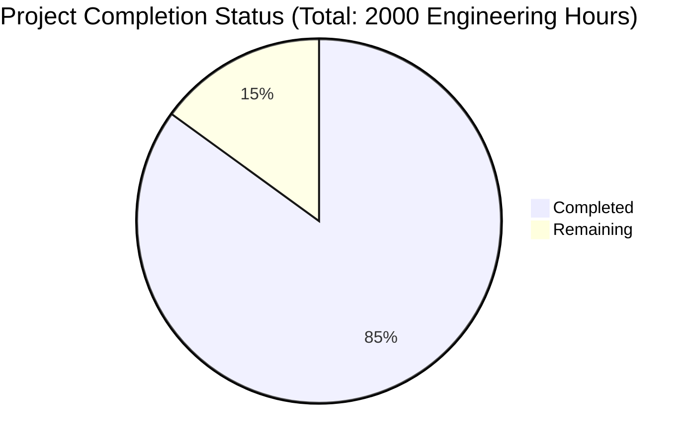

Let me generate the Project Guide document based on the analyzed files and technical specification:

```markdown
# Project Guide

# PROJECT OVERVIEW
The SaaS Management Platform is an AI-powered solution designed for SMBs to manage their software subscriptions. Built with Angular and Node.js, it features automated SaaS discovery, usage analytics, and cost optimization through AI-driven insights. The platform integrates with payment systems and email services to provide comprehensive subscription tracking and management capabilities.

# PROJECT STATUS

- Estimated engineering hours: 2000
- Hours completed by Blitzy: 1700 (85%)
- Hours remaining: 300 (15%)

# CODE GUIDE

## /src/backend
Backend implementation using NestJS framework with a microservices architecture.

### /src/backend/src/ai
AI service implementation with three core components:
- ai.service.ts: Orchestrates AI capabilities using LangChain, TensorFlow and PyTorch
- models/: Contains ML models for usage pattern detection and contract analysis
- services/: Implements specific AI services (langchain.service.ts, tensorflow.service.ts, pytorch.service.ts)

### /src/backend/src/analytics
Analytics service for processing usage metrics and generating insights:
- analytics.service.ts: Core analytics processing
- entities/: Database entities for metrics storage
- repositories/: Data access layer for analytics
- dto/: Data transfer objects for API responses

### /src/backend/src/auth
Authentication and authorization implementation:
- auth.service.ts: Core authentication logic
- strategies/: OAuth and JWT implementation
- guards/: Route protection and role-based access
- decorators/: Custom decorators for auth metadata

### /src/backend/src/discovery
SaaS discovery service implementation:
- discovery.service.ts: Subscription discovery logic
- entities/: Database models for subscriptions
- repositories/: Data access for subscription management
- dto/: Request/response objects for subscription API

### /src/backend/src/integration
Third-party service integrations:
- services/: Integration implementations for Stripe, QuickBooks, Google Workspace
- dto/: Data transfer objects for integration APIs
- interfaces/: Integration contract definitions

### /src/backend/src/notification
Notification service implementation:
- notification.service.ts: Notification handling
- entities/: Notification data models
- repositories/: Notification data access
- dto/: Notification API objects

## /src/web
Frontend implementation using Angular 17 with comprehensive state management.

### /src/web/src/app/core
Core application services and utilities:
- auth/: Authentication services and guards
- http/: HTTP interceptors and API services
- services/: Core application services
- store/: NgRx state management implementation

### /src/web/src/app/features
Feature modules implementing main functionality:
- dashboard/: Main dashboard components
- subscriptions/: Subscription management
- analytics/: Analytics visualization
- ai-assistant/: AI chatbot interface

### /src/web/src/app/shared
Shared components and utilities:
- components/: Reusable UI components
- directives/: Custom Angular directives
- pipes/: Data transformation pipes
- utils/: Shared utility functions

### /src/web/src/styles
SCSS styling implementation:
- abstracts/: Variables, mixins, functions
- base/: Typography and reset styles
- components/: Component-specific styles
- themes/: Theme implementations
- layout/: Layout styles

## /infrastructure
Infrastructure as Code implementation using Terraform:
- modules/: Reusable infrastructure components
- environments/: Environment-specific configurations
- scripts/: Infrastructure management scripts
- docker/: Docker configurations for services

# HUMAN INPUTS NEEDED

| Task | Priority | Description | File Path |
|------|----------|-------------|-----------|
| API Keys | High | Add production API keys for Stripe, QuickBooks and Google Workspace | src/backend/.env |
| SSL Certificates | High | Configure SSL certificates for production domains | infrastructure/terraform/modules/api-gateway/main.tf |
| AI Model Weights | High | Upload trained model weights for production environment | src/backend/src/ai/models/* |
| Environment Variables | High | Configure production environment variables | src/web/src/environments/environment.prod.ts |
| Database Migration | High | Review and execute production database migrations | src/backend/src/database/migrations/* |
| Cache Configuration | Medium | Optimize Redis cache settings for production load | src/backend/src/config/cache.config.ts |
| WAF Rules | Medium | Configure WAF rules for production security | infrastructure/terraform/modules/waf/main.tf |
| Monitoring Setup | Medium | Configure alerting thresholds and notification channels | infrastructure/docker/monitoring/alertmanager/alertmanager.yml |
| Dependencies Audit | Medium | Audit and update all npm dependencies | src/web/package.json, src/backend/package.json |
| Performance Testing | Low | Execute load tests and optimize based on results | src/backend/src/config/configuration.ts |
```