# Technical Specifications

# 1. INTRODUCTION

## 1.1 Executive Summary

The SaaS Management Platform is a comprehensive solution designed to help small to medium-sized businesses (SMBs) gain control over their growing software subscription ecosystem. By leveraging AI capabilities and integrating with existing business systems, the platform automatically discovers, tracks, and optimizes SaaS applications across the organization. The system addresses the critical challenge of shadow IT and uncontrolled software spend by providing centralized visibility, usage analytics, and intelligent recommendations for cost optimization.

Primary stakeholders include IT managers, finance teams, and department heads who currently struggle with fragmented software management processes. The platform is expected to reduce software spend by 20-30% through elimination of redundant subscriptions and optimization of existing licenses while improving security compliance and operational efficiency.

## 1.2 System Overview

### Project Context

| Aspect | Details |
|--------|----------|
| Market Position | First-to-market AI-powered SaaS management solution specifically targeting SMBs |
| Current Limitations | Manual tracking via spreadsheets, no centralized visibility, reactive renewal management |
| Enterprise Integration | Seamless integration with existing payment, accounting, and email systems |

### High-Level Description

The system employs a modern web architecture built on Angular and Node.js, deployed on AWS infrastructure. Core capabilities include:

- AI-powered SaaS discovery through payment and email analysis
- Centralized subscription tracking and management
- Real-time usage monitoring and analytics
- Intelligent cost optimization recommendations
- Conversational AI assistant for instant insights

### Success Criteria

| Category | Metrics |
|----------|----------|
| Cost Reduction | 20-30% reduction in overall SaaS spend within 6 months |
| Efficiency | 75% reduction in time spent on subscription management |
| Discovery | 95% accuracy in automated SaaS application discovery |
| User Adoption | 80% monthly active users within first quarter |

## 1.3 Scope

### In-Scope Elements

| Component | Details |
|-----------|----------|
| Core Features | - Automated SaaS discovery and tracking<br>- Subscription management dashboard<br>- Usage analytics and reporting<br>- AI-powered insights and recommendations<br>- Renewal management and notifications |
| Implementation | - Web application deployment<br>- Payment system integrations<br>- Email service connections<br>- Google Workspace integration<br>- AI/ML model implementation |
| User Groups | - IT administrators<br>- Finance teams<br>- Department managers<br>- System administrators |
| Data Coverage | - Subscription details<br>- Usage metrics<br>- Cost data<br>- Contract information |

### Out-of-Scope Elements

- Direct SaaS vendor integrations beyond Google Workspace
- Procurement workflow automation
- Custom reporting engine
- Mobile native applications
- Enterprise-scale deployment features
- Multi-language support (initial release English-only)
- Legacy system data migration
- Custom SSO provider integrations

# 2. SYSTEM ARCHITECTURE

## 2.1 High-Level Architecture

The SaaS Management Platform follows a microservices architecture pattern deployed on AWS infrastructure, emphasizing scalability, resilience, and maintainability.

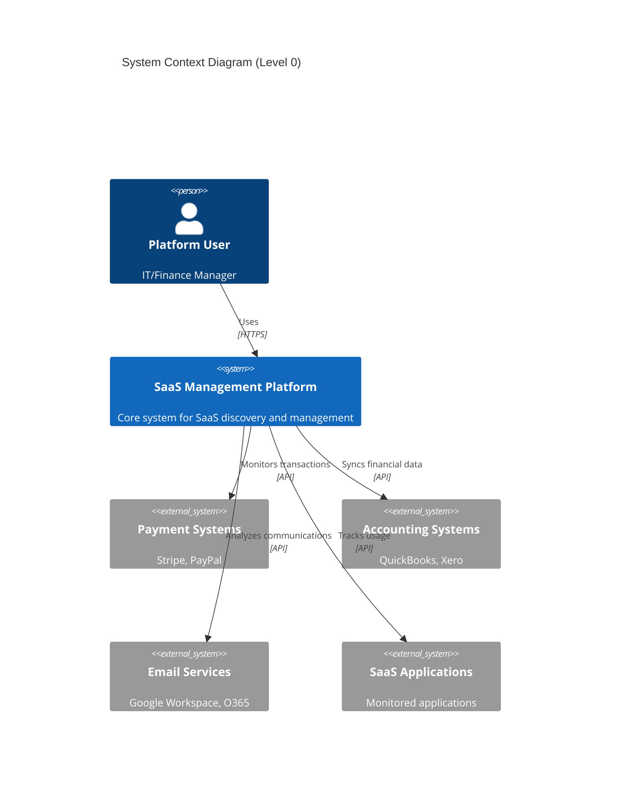

```mermaid
C4Container
    title Container Diagram (Level 1)
    
    Container(web, "Web Application", "Angular", "User interface")
    Container(api, "API Gateway", "AWS API Gateway", "API management")
    
    Container_Boundary(services, "Microservices") {
        Container(discovery, "Discovery Service", "Node.js", "SaaS detection")
        Container(analytics, "Analytics Service", "Node.js", "Usage analysis")
        Container(ai, "AI Service", "Python", "ML processing")
        Container(notification, "Notification Service", "Node.js", "Alerts")
    }
    
    ContainerDb(db, "Primary Database", "PostgreSQL", "Subscription data")
    ContainerDb(docs, "Document Store", "MongoDB", "Contracts/Analysis")
    ContainerDb(cache, "Cache", "Redis", "Performance cache")
    
    Rel(web, api, "Uses", "HTTPS")
    Rel(api, discovery, "Routes", "HTTP/gRPC")
    Rel(api, analytics, "Routes", "HTTP/gRPC")
    Rel(api, ai, "Routes", "HTTP/gRPC")
    Rel(api, notification, "Routes", "HTTP/gRPC")
    
    Rel(discovery, db, "Reads/Writes")
    Rel(analytics, db, "Reads")
    Rel(ai, docs, "Reads/Writes")
    Rel(services, cache, "Uses")
```

## 2.2 Component Details

### 2.2.1 Core Components

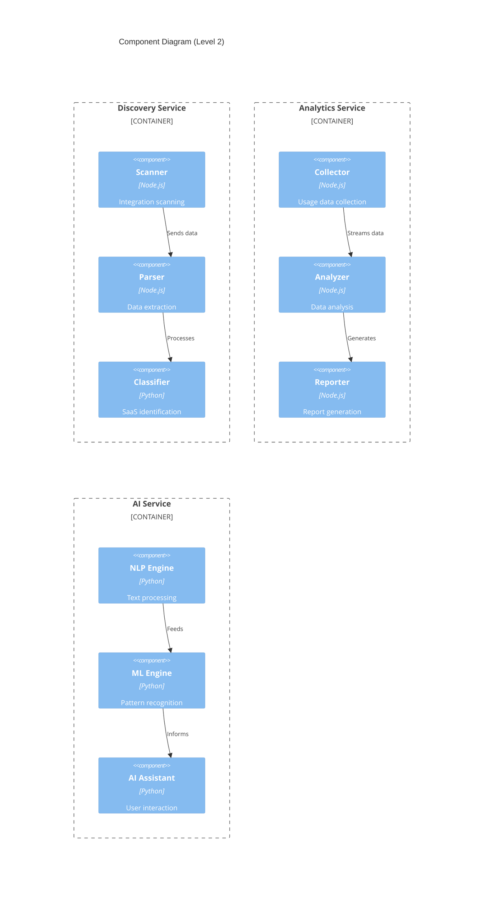

### 2.2.2 Data Flow Architecture

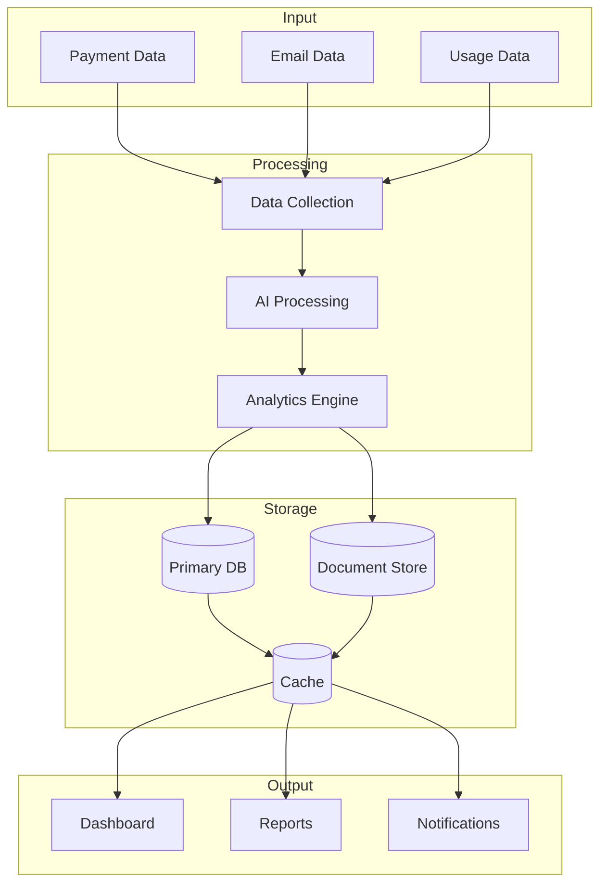

### 2.2.3 Deployment Architecture

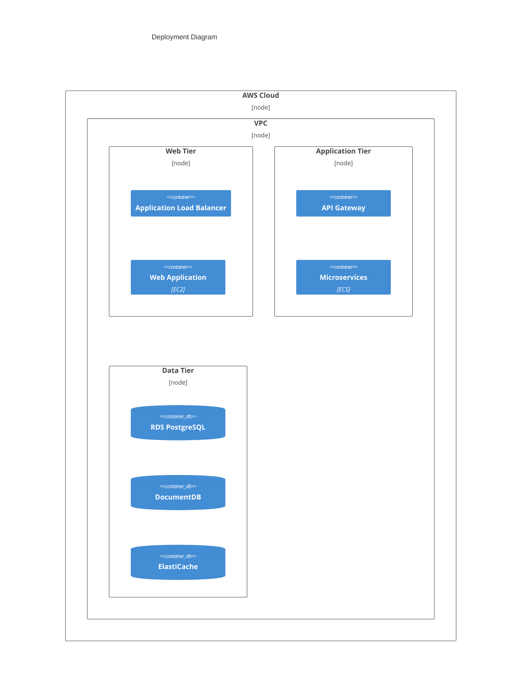

## 2.3 Technical Decisions

### 2.3.1 Architecture Choices

| Component | Choice | Justification |
|-----------|--------|---------------|
| Architecture Style | Microservices | Enables independent scaling and deployment of components |
| Communication | gRPC/REST | gRPC for internal, REST for external communications |
| Data Storage | Multi-database | Different storage types for different data characteristics |
| Caching | Redis | High performance, distributed caching capabilities |
| Message Queue | AWS SQS | Reliable asynchronous communication between services |

### 2.3.2 Technology Stack

| Layer | Technology | Purpose |
|-------|------------|----------|
| Frontend | Angular | Rich, responsive user interface |
| API Gateway | AWS API Gateway | Request routing and API management |
| Services | Node.js, Python | Business logic implementation |
| ML/AI | TensorFlow, PyTorch | Machine learning and AI capabilities |
| Data Storage | PostgreSQL, MongoDB | Structured and unstructured data storage |

## 2.4 Cross-Cutting Concerns

### 2.4.1 Monitoring and Observability

- AWS CloudWatch for metrics and logging
- Distributed tracing using AWS X-Ray
- Custom dashboards for system health monitoring
- Automated alerting for critical issues

### 2.4.2 Security Architecture

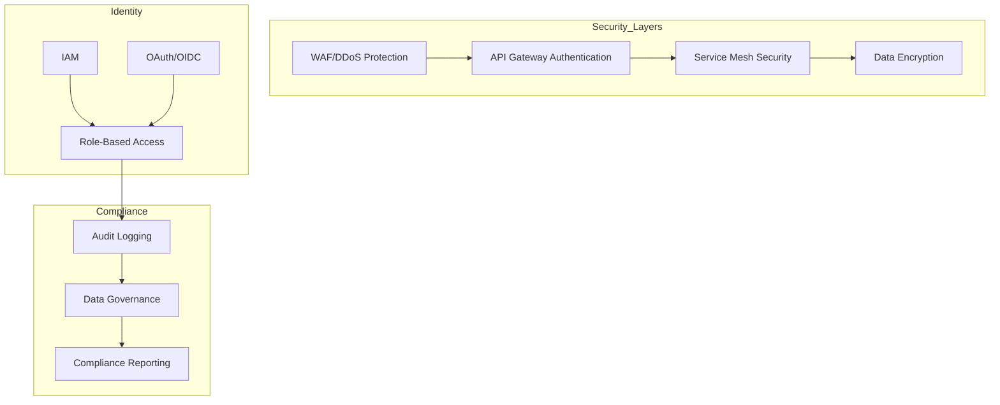

### 2.4.3 Disaster Recovery

| Component | RPO | RTO | Strategy |
|-----------|-----|-----|-----------|
| Web Application | 0 min | 5 min | Multi-AZ deployment |
| Databases | 5 min | 15 min | Cross-region replication |
| Cache | 0 min | 1 min | Redis cluster with replicas |
| Document Store | 15 min | 30 min | Periodic snapshots |

# 3. SYSTEM COMPONENTS ARCHITECTURE

## 3.1 User Interface Design

### 3.1.1 Design System Specifications

| Component | Specification | Details |
|-----------|--------------|----------|
| Typography | Primary: Inter | - Headings: 32/24/20/18/16px<br>- Body: 16/14px<br>- Monospace: Source Code Pro |
| Color Palette | Brand Colors | - Primary: #2563EB<br>- Secondary: #3B82F6<br>- Accent: #60A5FA<br>- Error: #EF4444 |
| Spacing | 8px Base Unit | - Margins: 8/16/24/32/48px<br>- Padding: 8/16/24/32px<br>- Grid: 8px gutters |
| Elevation | 4 Levels | - Surface: 0px<br>- Card: 2px<br>- Dialog: 4px<br>- Modal: 8px |

### 3.1.2 Layout Structure

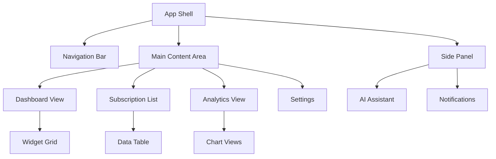

### 3.1.3 Critical User Flows

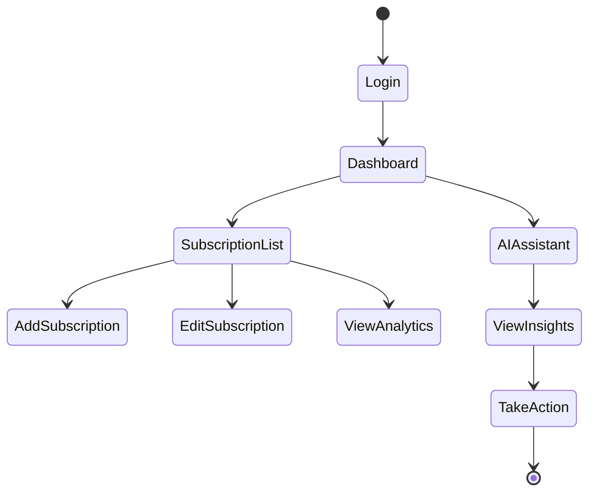

### 3.1.4 Responsive Breakpoints

| Breakpoint | Width | Layout Adjustments |
|------------|-------|-------------------|
| Mobile | < 640px | Single column, stacked navigation |
| Tablet | 641-1024px | Two column, collapsible sidebar |
| Desktop | > 1024px | Three column, fixed sidebar |
| Large | > 1440px | Three column, expanded widgets |

## 3.2 Database Design

### 3.2.1 Entity Relationship Diagram

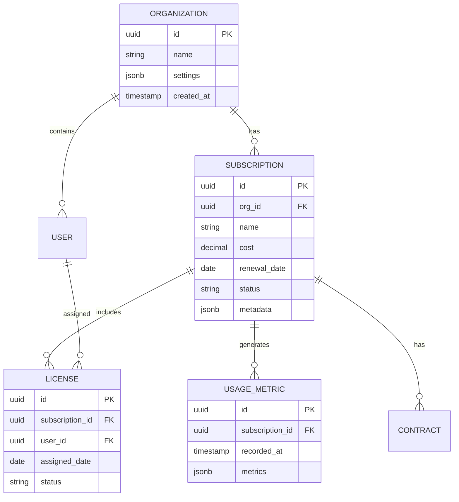

### 3.2.2 Data Management Strategy

| Aspect | Strategy | Implementation |
|--------|----------|----------------|
| Partitioning | Time-based | Monthly partitions for metrics data |
| Indexing | Selective | Covering indexes for common queries |
| Caching | Multi-level | Redis L1, PostgreSQL JSONB L2 |
| Archival | Rolling window | 24-month active window, archive to S3 |
| Backup | Continuous | Streaming replication + daily snapshots |

### 3.2.3 Query Optimization

```sql
-- Example Optimized Queries
CREATE INDEX idx_subscription_search ON subscriptions 
USING GIN (to_tsvector('english', name));

CREATE INDEX idx_usage_metrics ON usage_metrics 
USING BRIN (recorded_at);

CREATE INDEX idx_subscription_cost ON subscriptions 
USING btree (org_id, cost) 
INCLUDE (name, renewal_date);
```

## 3.3 API Design

### 3.3.1 API Architecture

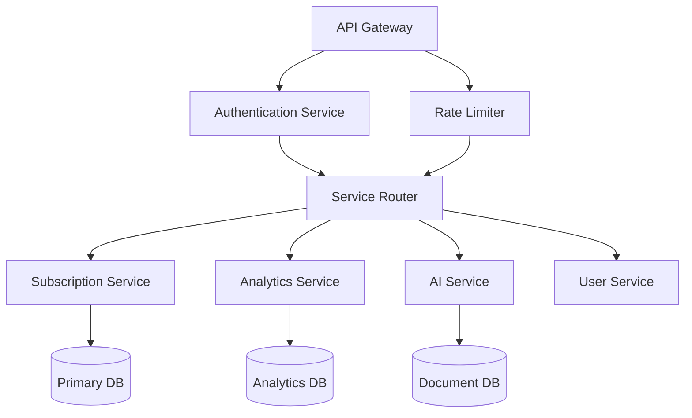

### 3.3.2 API Endpoints

| Endpoint | Method | Purpose | Rate Limit |
|----------|--------|---------|------------|
| /api/v1/subscriptions | GET | List subscriptions | 100/min |
| /api/v1/subscriptions/{id} | GET | Get subscription details | 300/min |
| /api/v1/analytics/usage | GET | Get usage metrics | 60/min |
| /api/v1/ai/insights | POST | Generate AI insights | 30/min |

### 3.3.3 Authentication Flow

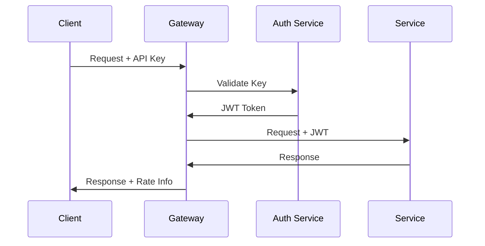

### 3.3.4 Response Formats

```json
{
  "data": {
    "id": "sub_123",
    "type": "subscription",
    "attributes": {
      "name": "Example SaaS",
      "cost": 99.99,
      "renewalDate": "2024-12-31"
    },
    "relationships": {
      "licenses": {
        "data": [
          {"type": "license", "id": "lic_456"}
        ]
      }
    }
  },
  "meta": {
    "requestId": "req_789",
    "timestamp": "2024-01-20T12:00:00Z"
  }
}
```

### 3.3.5 Error Handling

| Status Code | Error Type | Response Format |
|-------------|------------|-----------------|
| 400 | Bad Request | {"error": {"code": "VAL_001", "message": "Invalid input"}} |
| 401 | Unauthorized | {"error": {"code": "AUTH_001", "message": "Invalid token"}} |
| 403 | Forbidden | {"error": {"code": "PERM_001", "message": "Insufficient permissions"}} |
| 429 | Rate Limited | {"error": {"code": "RATE_001", "message": "Too many requests"}} |

# 4. TECHNOLOGY STACK

## 4.1 PROGRAMMING LANGUAGES

| Platform/Component | Language | Version | Justification |
|-------------------|----------|---------|---------------|
| Frontend | TypeScript | 5.0+ | Type safety, enhanced IDE support, better maintainability for large Angular applications |
| Backend Services | Node.js | 20 LTS | Consistent JavaScript ecosystem, excellent async performance, rich npm package ecosystem |
| AI/ML Services | Python | 3.11+ | Superior ML libraries, natural language processing capabilities, extensive AI tooling |
| Infrastructure | HCL (Terraform) | 1.5+ | Infrastructure as code, AWS ecosystem integration, version control friendly |

## 4.2 FRAMEWORKS & LIBRARIES

### Core Frameworks

| Framework | Version | Purpose | Justification |
|-----------|---------|---------|---------------|
| Angular | 17.x | Frontend Framework | Enterprise-grade features, robust typing, comprehensive tooling |
| NestJS | 10.x | Backend Framework | TypeScript support, modular architecture, OpenAPI integration |
| TensorFlow | 2.14+ | ML Processing | Industry standard ML framework, extensive model support |
| Langchain | 0.1.x | AI Operations | Simplified AI/LLM integration, conversation management |

### Supporting Libraries

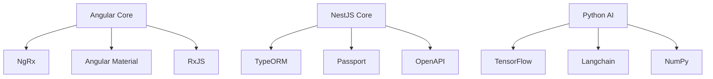

## 4.3 DATABASES & STORAGE

### Primary Databases

| Database | Version | Purpose | Configuration |
|----------|---------|---------|---------------|
| PostgreSQL | 15.x | Relational Data | Multi-AZ deployment, Read replicas |
| MongoDB | 7.x | Document Storage | Atlas cluster, Automatic scaling |
| Redis | 7.x | Caching/Real-time | ElastiCache, Cluster mode |

### Storage Services

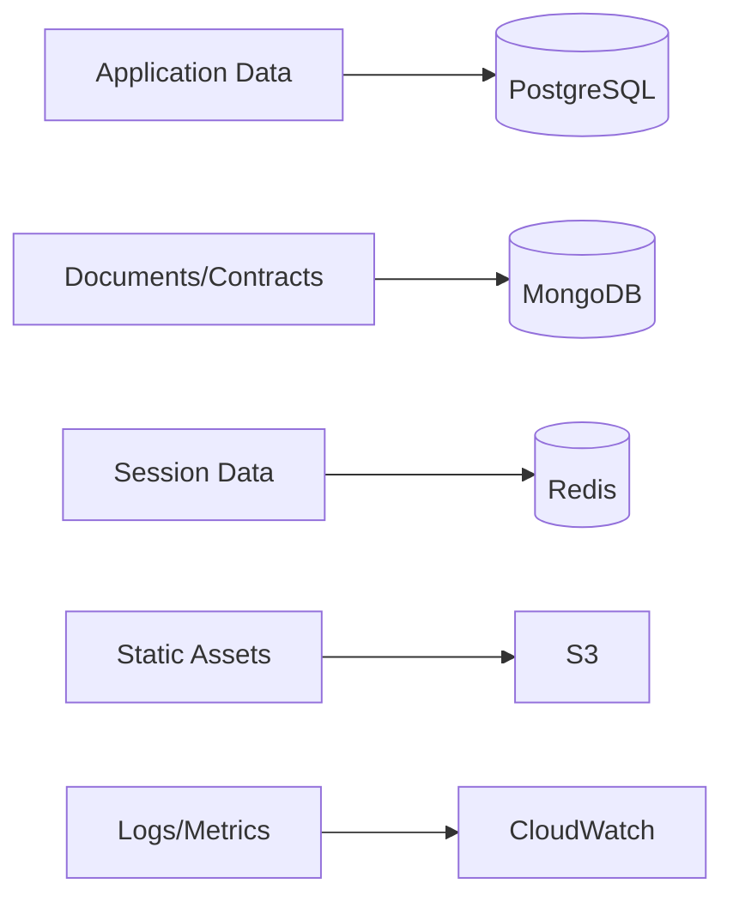

## 4.4 THIRD-PARTY SERVICES

### Integration Services

| Service | Purpose | Integration Method |
|---------|---------|-------------------|
| Stripe API | Payment Processing | REST API / Webhooks |
| Google Workspace | Usage Analytics | OAuth 2.0 / REST API |
| QuickBooks | Accounting Data | OAuth 2.0 / REST API |
| Auth0 | Authentication | OIDC / OAuth 2.0 |

### AWS Services

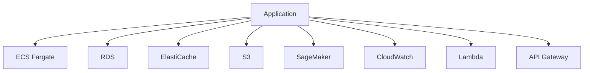

## 4.5 DEVELOPMENT & DEPLOYMENT

### Development Tools

| Tool | Version | Purpose |
|------|---------|---------|
| VS Code | Latest | Primary IDE |
| Docker | 24.x | Containerization |
| Git | 2.42+ | Version Control |
| Postman | Latest | API Testing |

### CI/CD Pipeline

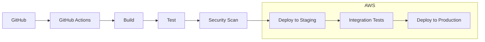

### Infrastructure as Code

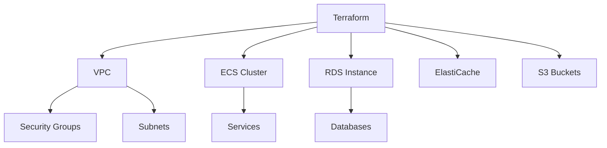

### Containerization Strategy

| Component | Base Image | Build Strategy |
|-----------|------------|----------------|
| Frontend | node:20-alpine | Multi-stage build |
| Backend | node:20-alpine | Multi-stage build |
| AI Services | python:3.11-slim | Multi-stage build |
| Jobs | node:20-alpine | Single stage |

# 5. SYSTEM DESIGN

## 5.1 User Interface Design

### 5.1.1 Dashboard Layout

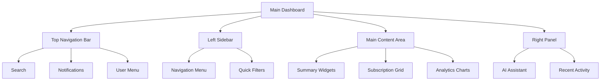

### 5.1.2 Key Interface Components

| Component | Description | Key Features |
|-----------|-------------|--------------|
| Top Navigation | Fixed header with global actions | - Global search<br>- Notification center<br>- User settings |
| Left Sidebar | Primary navigation menu | - Collapsible menu<br>- Quick filters<br>- Subscription categories |
| Main Content | Dynamic content area | - Responsive grid layout<br>- Drag-and-drop widgets<br>- Infinite scroll lists |
| AI Assistant Panel | Contextual AI interface | - Natural language input<br>- Context-aware responses<br>- Action suggestions |

### 5.1.3 Responsive Layouts

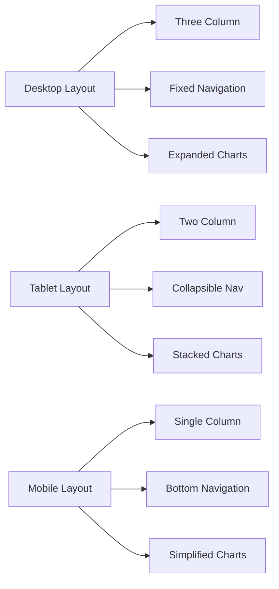

## 5.2 Database Design

### 5.2.1 Core Schema

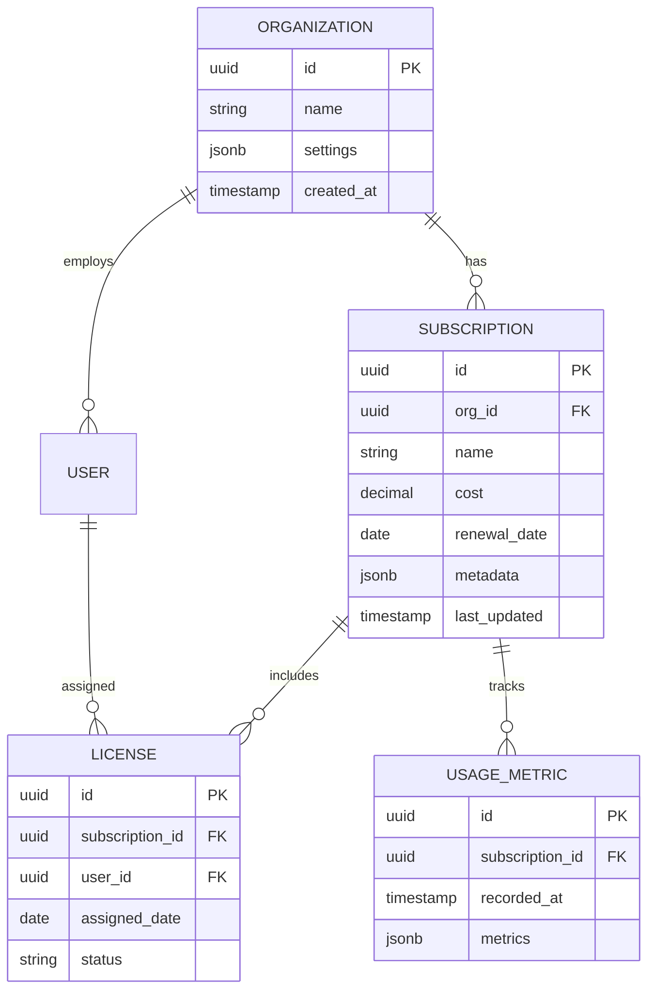

### 5.2.2 Data Storage Strategy

| Data Type | Storage Solution | Justification |
|-----------|-----------------|---------------|
| Relational Data | PostgreSQL | ACID compliance, complex queries |
| Document Storage | MongoDB | Flexible schema for metadata |
| Cache Layer | Redis | High-performance, real-time data |
| File Storage | S3 | Scalable contract document storage |

### 5.2.3 Indexing Strategy

```sql
-- Performance-optimized indexes
CREATE INDEX idx_subscription_search 
ON subscriptions USING gin(to_tsvector('english', name));

CREATE INDEX idx_usage_metrics 
ON usage_metrics USING brin(recorded_at);

CREATE INDEX idx_license_lookup 
ON licenses (subscription_id, user_id);
```

## 5.3 API Design

### 5.3.1 REST API Structure

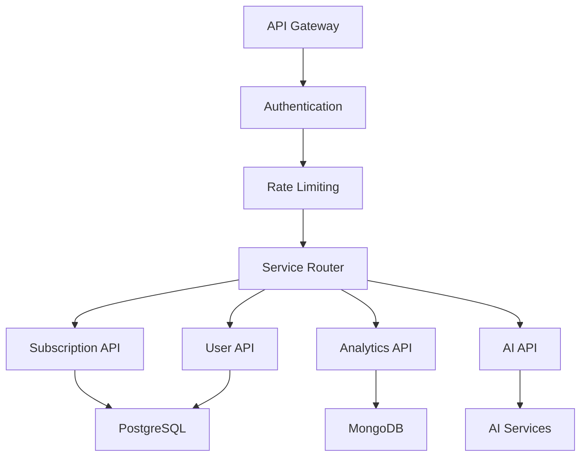

### 5.3.2 API Endpoints

| Endpoint | Method | Purpose | Response Format |
|----------|--------|---------|-----------------|
| /api/v1/subscriptions | GET | List subscriptions | JSON collection |
| /api/v1/subscriptions/{id} | GET | Get subscription details | JSON object |
| /api/v1/analytics/usage | GET | Get usage metrics | JSON metrics |
| /api/v1/ai/insights | POST | Generate AI insights | JSON analysis |

### 5.3.3 Authentication Flow

```mermaid
sequenceDiagram
    participant Client
    participant Gateway
    participant Auth
    participant Service
    
    Client->>Gateway: Request + API Key
    Gateway->>Auth: Validate Key
    Auth->>Gateway: JWT Token
    Gateway->>Service: Request + JWT
    Service->>Gateway: Response
    Gateway->>Client: Response + Rate Info
```

### 5.3.4 WebSocket Events

| Event | Direction | Purpose |
|-------|-----------|---------|
| subscription.updated | Server→Client | Real-time subscription updates |
| usage.alert | Server→Client | Usage threshold notifications |
| ai.insight | Server→Client | Real-time AI recommendations |
| user.action | Client→Server | User interaction tracking |

6. USER INTERFACE DESIGN

### 6.1 Common UI Elements Key

```
Icons:
[?] - Help/Information tooltip
[$] - Financial/Cost information
[i] - General information
[+] - Add new item
[x] - Close/Delete
[<] [>] - Navigation arrows
[^] - Upload
[#] - Dashboard/Menu
[@] - User profile
[!] - Alert/Warning
[=] - Settings
[*] - Favorite/Important

Interactive Elements:
[ ] - Checkbox
( ) - Radio button
[Button] - Clickable button
[...] - Text input field
[====] - Progress bar
[v] - Dropdown menu
```

### 6.2 Main Dashboard

```
+----------------------------------------------------------+
|  [#] SaaS Management Platform     [@User] [?] [=]         |
+----------------------------------------------------------+
|                                                           |
| +----------------+ +----------------+ +----------------+   |
| | Total Spend    | | Active Apps    | | Upcoming       |  |
| | [$] $45,230    | | [i] 48        | | Renewals [!]   |  |
| | +12% vs last   | | +3 this month | | 5 in next 30d  |  |
| +----------------+ +----------------+ +----------------+   |
|                                                           |
| +------------------------+ +-------------------------+     |
| | Cost by Department     | | License Utilization     |    |
| | [====== ] Engineering  | | [========= ] 90% Used   |    |
| | [=== ] Marketing      | | [== ] 20% Inactive      |    |
| | [==== ] Sales         | | [= ] 10% Unused         |    |
| +------------------------+ +-------------------------+     |
|                                                           |
| Recent Activity                        [v] Last 7 days    |
| +------------------------------------------------------+ |
| | [!] New subscription detected: Slack - $1,200/month   | |
| | [i] 3 licenses unassigned in Jira                    | |
| | [$] Upcoming renewal: Adobe CC - $899 on 03/15/24    | |
| +------------------------------------------------------+ |
|                                                           |
+----------------------------------------------------------+
```

### 6.3 Subscription Management View

```
+----------------------------------------------------------+
|  [#] Subscriptions     [+ Add New] [^Import]              |
+----------------------------------------------------------+
| Search: [...........................] [v] Filter           |
|                                                           |
| +------------------------------------------------------+ |
| | Name          Status   Users  Cost/mo  Renewal        | |
| |------------------------------------------------------| |
| | [*] Slack     Active   45/50  $750    Apr 15, 2024   | |
| |     [i] [=] [$] [x]                                  | |
| |------------------------------------------------------| |
| | Google Work.  Active   89/100 $1,780  May 1, 2024    | |
| |     [i] [=] [$] [x]                                  | |
| |------------------------------------------------------| |
| | Zoom         Warning  25/25  $375    Mar 10, 2024    | |
| |     [i] [=] [$] [x]                                  | |
| +------------------------------------------------------+ |
|                                                           |
| [< Prev] Page 1 of 5 [Next >]                            |
+----------------------------------------------------------+
```

### 6.4 AI Assistant Interface

```
+----------------------------------------------------------+
|  AI Assistant                                    [-] [x]   |
+----------------------------------------------------------+
|                                                           |
| +------------------------------------------------------+ |
| | Chat History                                          | |
| |                                                      | |
| | You: Show me underutilized subscriptions             | |
| |                                                      | |
| | Assistant: I found 3 subscriptions with low usage:   | |
| | 1. Adobe CC - 5/20 licenses used                     | |
| | 2. Asana - 12/50 licenses used                      | |
| | 3. Zoom - 60% below average usage                    | |
| |                                                      | |
| | [Take Action] [View Details] [Dismiss]               | |
| |                                                      | |
| +------------------------------------------------------+ |
|                                                           |
| [...Type your question here...........................]   |
| [Send]                                                    |
+----------------------------------------------------------+
```

### 6.5 License Management View

```
+----------------------------------------------------------+
|  License Management - Slack                    [Export]    |
+----------------------------------------------------------+
| Total Licenses: 50  |  Used: 45  |  Available: 5          |
| [=============================== ] 90% Utilized           |
|                                                           |
| +------------------------------------------------------+ |
| | User               Department    Last Active   Status  | |
| |------------------------------------------------------| |
| | [@] John Smith     Engineering   2h ago       Active  | |
| | [@] Sarah Jones    Marketing     1d ago       Active  | |
| | [@] Mike Johnson   Sales         8d ago    [!]Inactive| |
| +------------------------------------------------------+ |
|                                                           |
| [+ Assign License] [Reclaim Selected] [Bulk Update]       |
+----------------------------------------------------------+
```

### 6.6 Cost Analytics View

```
+----------------------------------------------------------+
|  Cost Analytics                      [v] Last 12 Months    |
+----------------------------------------------------------+
| Total Spend: $542,680    YoY Change: +15%                 |
|                                                           |
| Department Breakdown    +-------------------------+       |
| Engineering   [$45,230] |[============= ] 35%    |       |
| Marketing     [$32,150] |[========= ] 25%        |       |
| Sales         [$28,900] |[======= ] 20%          |       |
| HR            [$15,400] |[==== ] 10%             |       |
|                                                           |
| Top Expenses                                              |
| +------------------------------------------------------+ |
| | 1. Salesforce     $12,500/mo   [View] [Optimize]     | |
| | 2. Google Cloud   $8,900/mo    [View] [Optimize]     | |
| | 3. Microsoft 365  $7,200/mo    [View] [Optimize]     | |
| +------------------------------------------------------+ |
|                                                           |
| [Export Report] [Schedule Report] [Share]                 |
+----------------------------------------------------------+
```

### 6.7 Mobile Responsive Layouts

```
+----------------------+
| [#] SaaS Management  |
| [@] [=] [?]         |
+----------------------+
| Quick Stats          |
| [$] $45,230 Spend   |
| [i] 48 Active Apps  |
| [!] 5 Renewals Due  |
+----------------------+
| Recent Activity     |
| [v]                 |
| - New Slack sub     |
| - 3 unused licenses |
| - Renewal upcoming  |
+----------------------+
| [#Dashboard]        |
| [$Costs] [@Users]   |
| [=Settings]         |
+----------------------+
```

### 6.8 Navigation Structure

```
+------------------+
| Primary Nav      |
+------------------+
|                  |
+-- [#] Dashboard  |
|                  |
+-- [$] Costs      |
|   +-- Overview   |
|   +-- Analytics  |
|   +-- Reports    |
|                  |
+-- [@] Users      |
|   +-- Directory  |
|   +-- Licenses   |
|   +-- Access     |
|                  |
+-- [=] Settings   |
    +-- Account    |
    +-- Integrations
    +-- Alerts     |
    +-- Team       |
+------------------+
```

# 7. SECURITY CONSIDERATIONS

## 7.1 Authentication and Authorization

### 7.1.1 Authentication Flow

```mermaid
sequenceDiagram
    participant User
    participant Frontend
    participant AuthService
    participant OAuth
    participant JWT
    participant Database

    User->>Frontend: Login Request
    Frontend->>AuthService: Forward Credentials
    AuthService->>OAuth: Validate OAuth (if SSO)
    OAuth-->>AuthService: OAuth Token
    AuthService->>JWT: Generate JWT
    JWT-->>AuthService: Signed Token
    AuthService->>Database: Log Session
    AuthService-->>Frontend: Return JWT
    Frontend-->>User: Session Established
```

### 7.1.2 Authorization Levels

| Role | Permissions | Access Level |
|------|------------|--------------|
| Admin | Full system access | Create, Read, Update, Delete all resources |
| Finance Manager | Cost management | Read all, Update cost-related data |
| Department Manager | Department-level access | Read/Update department resources |
| User | Basic access | Read assigned subscriptions |
| Integration Service | API access | Limited to specific endpoints |

### 7.1.3 Authentication Methods

| Method | Implementation | Use Case |
|--------|---------------|-----------|
| SSO | OAuth 2.0/OIDC with Auth0 | Primary enterprise login |
| MFA | TOTP via AWS Cognito | Required for admin access |
| API Keys | JWT with rotation | Service-to-service auth |
| Session Management | Redis-backed JWT | Web application access |

## 7.2 Data Security

### 7.2.1 Encryption Strategy

```mermaid
flowchart TD
    A[Data Entry] --> B{Encryption Layer}
    B --> C[Transport Encryption]
    B --> D[Storage Encryption]
    
    C --> E[TLS 1.3]
    C --> F[Perfect Forward Secrecy]
    
    D --> G[AES-256 at rest]
    D --> H[Field-level encryption]
    
    G --> I[(Encrypted Storage)]
    H --> J[(Sensitive Fields)]
    
    K[Key Management] --> L[AWS KMS]
    L --> M[Auto Rotation]
    L --> N[Access Control]
```

### 7.2.2 Data Classification

| Classification | Examples | Security Measures |
|----------------|----------|------------------|
| Critical | Payment credentials, API keys | Field-level encryption, restricted access |
| Sensitive | Contract details, costs | Encrypted at rest, audit logging |
| Internal | Usage statistics, metadata | Standard encryption, role-based access |
| Public | Application names, categories | No additional encryption |

### 7.2.3 Data Protection Measures

- Database encryption using AWS RDS encryption
- S3 bucket encryption for document storage
- Redis encryption for cached data
- Secure key management via AWS KMS
- Regular encryption key rotation
- Data masking in non-production environments

## 7.3 Security Protocols

### 7.3.1 Network Security

```mermaid
flowchart TD
    A[Internet] --> B[WAF]
    B --> C[Load Balancer]
    C --> D[API Gateway]
    
    subgraph VPC
        D --> E[Application Tier]
        E --> F[Database Tier]
        
        G[Security Groups] --> E
        G --> F
        
        H[NACL] --> G
    end
    
    I[CloudWatch] --> J[Security Monitoring]
    J --> K[Alert System]
```

### 7.3.2 Security Standards Compliance

| Standard | Implementation | Verification |
|----------|---------------|--------------|
| OWASP Top 10 | Security controls and testing | Quarterly security audits |
| SOC 2 | Process documentation and controls | Annual certification |
| GDPR | Data protection measures | Regular compliance audits |
| PCI DSS | Payment data handling | Annual assessment |

### 7.3.3 Security Monitoring

| Component | Monitoring Method | Alert Threshold |
|-----------|------------------|-----------------|
| Failed Logins | CloudWatch Metrics | >5 attempts/minute |
| API Usage | AWS WAF | >100 requests/second |
| Data Access | AWS CloudTrail | Unauthorized attempts |
| System Changes | AWS Config | Configuration changes |

### 7.3.4 Incident Response

```mermaid
stateDiagram-v2
    [*] --> Detection
    Detection --> Analysis
    Analysis --> Containment
    Containment --> Eradication
    Eradication --> Recovery
    Recovery --> PostIncident
    PostIncident --> [*]
    
    Analysis --> Escalation
    Escalation --> Containment
```

### 7.3.5 Security Update Process

| Phase | Action | Frequency |
|-------|--------|-----------|
| Assessment | Vulnerability scanning | Weekly |
| Patching | Security updates | Monthly or as needed |
| Dependencies | Package updates | Bi-weekly |
| Infrastructure | AWS security patches | Automated with AWS |
| Penetration Testing | External security audit | Quarterly |

# 8. INFRASTRUCTURE

## 8.1 DEPLOYMENT ENVIRONMENT

The SaaS Management Platform will be deployed entirely on AWS cloud infrastructure, leveraging a multi-region architecture for high availability and disaster recovery.

### Primary Architecture

```mermaid
graph TB
    subgraph Production Environment
        A[Route 53] --> B[CloudFront]
        B --> C[Application Load Balancer]
        C --> D[ECS Cluster]
        D --> E[RDS Multi-AZ]
        D --> F[ElastiCache]
        D --> G[DocumentDB]
    end
    
    subgraph DR Environment
        H[Standby ALB]
        I[ECS Cluster]
        J[RDS Replica]
        K[ElastiCache Replica]
        L[DocumentDB Replica]
    end
    
    B --> H
    E --> J
    F --> K
    G --> L
```

### Environment Specifications

| Environment | Region | Purpose | Scaling |
|-------------|---------|----------|----------|
| Production | US-East-1 | Primary workload | Auto-scaling, 3 AZs |
| DR | US-West-2 | Disaster recovery | Warm standby |
| Staging | US-East-2 | Pre-production testing | Fixed capacity |
| Development | US-East-1 | Development and testing | Minimal capacity |

## 8.2 CLOUD SERVICES

### Core AWS Services

| Service | Purpose | Configuration |
|---------|----------|--------------|
| ECS Fargate | Container orchestration | Serverless, auto-scaling |
| RDS PostgreSQL | Primary database | Multi-AZ, r5.2xlarge |
| DocumentDB | Document storage | 3-node cluster |
| ElastiCache | Redis caching | Cluster mode enabled |
| S3 | Object storage | Versioning enabled |
| CloudFront | CDN | Edge locations worldwide |
| SageMaker | ML model hosting | On-demand inference |

### Supporting Services

```mermaid
graph LR
    A[CloudWatch] --> B[Monitoring]
    A --> C[Logging]
    A --> D[Alerting]
    
    E[IAM] --> F[Access Control]
    E --> G[Role Management]
    
    H[KMS] --> I[Key Management]
    H --> J[Encryption]
    
    K[Shield] --> L[DDoS Protection]
    K --> M[WAF]
```

## 8.3 CONTAINERIZATION

### Docker Configuration

```mermaid
graph TD
    subgraph Container Architecture
        A[Angular Frontend] --> B[Nginx]
        C[Node.js API] --> D[Node Alpine]
        E[Python AI Services] --> F[Python Slim]
        G[Jobs/Workers] --> H[Node Alpine]
    end
    
    subgraph Build Process
        I[Multi-stage Build] --> J[Production Image]
        J --> K[Security Scan]
        K --> L[Registry Push]
    end
```

### Container Specifications

| Service | Base Image | Memory Limit | CPU Limit |
|---------|------------|--------------|-----------|
| Frontend | nginx:alpine | 512MB | 0.5 vCPU |
| API Services | node:20-alpine | 1GB | 1.0 vCPU |
| AI Services | python:3.11-slim | 2GB | 2.0 vCPU |
| Workers | node:20-alpine | 1GB | 1.0 vCPU |

## 8.4 ORCHESTRATION

### ECS Configuration

```mermaid
graph TB
    subgraph ECS Cluster
        A[Service Discovery]
        B[Task Definitions]
        C[Auto Scaling]
        
        subgraph Services
            D[Frontend Service]
            E[API Service]
            F[AI Service]
            G[Worker Service]
        end
        
        A --> Services
        B --> Services
        C --> Services
    end
```

### Service Definitions

| Service | Tasks | Auto-scaling | Health Check |
|---------|-------|--------------|--------------|
| Frontend | 3 min, 10 max | CPU 70% | HTTP 200 |
| API | 4 min, 20 max | Request count | TCP 3000 |
| AI Services | 2 min, 8 max | Memory 80% | HTTP 200 |
| Workers | 2 min, 10 max | Queue length | Process check |

## 8.5 CI/CD PIPELINE

### Pipeline Architecture

```mermaid
graph LR
    A[GitHub] --> B[GitHub Actions]
    B --> C[Build]
    C --> D[Test]
    D --> E[Security Scan]
    E --> F[Deploy Staging]
    F --> G[Integration Tests]
    G --> H[Deploy Production]
    
    subgraph Environments
        F
        G
        H
    end
    
    subgraph Quality Gates
        I[Unit Tests]
        J[SAST]
        K[DAST]
        L[Performance]
    end
    
    D --> I
    E --> J
    F --> K
    G --> L
```

### Deployment Stages

| Stage | Actions | Success Criteria | Rollback Plan |
|-------|---------|------------------|---------------|
| Build | Code compilation, container build | All builds pass | N/A |
| Test | Unit tests, integration tests | 100% pass rate | N/A |
| Security | SAST, container scanning | No high vulnerabilities | N/A |
| Staging | Deploy to staging | All health checks pass | Automatic |
| Production | Blue-green deployment | Zero downtime | Automatic rollback |

### Monitoring and Alerts

```mermaid
graph TD
    A[CloudWatch] --> B[Metrics]
    A --> C[Logs]
    A --> D[Traces]
    
    B --> E[Dashboards]
    C --> F[Log Insights]
    D --> G[X-Ray]
    
    E & F & G --> H[AlertManager]
    H --> I[PagerDuty]
    H --> J[Slack]
    H --> K[Email]
```

# APPENDICES

## A.1 Additional Technical Information

### A.1.1 AI Model Specifications

| Component | Technology | Purpose | Configuration |
|-----------|------------|----------|---------------|
| Contract Analysis | TensorFlow | Document parsing | Fine-tuned BERT model |
| Usage Pattern Detection | PyTorch | Anomaly detection | Custom CNN architecture |
| Natural Language Processing | Langchain | AI Assistant | GPT-based model |
| Classification | Scikit-learn | SaaS categorization | Random Forest classifier |

### A.1.2 Integration Authentication Flows

```mermaid
sequenceDiagram
    participant Client
    participant Platform
    participant OAuth
    participant Service
    
    Client->>Platform: Request Integration
    Platform->>OAuth: Initialize OAuth Flow
    OAuth->>Client: Authorization Request
    Client->>OAuth: Grant Permission
    OAuth->>Platform: Authorization Code
    Platform->>OAuth: Exchange Code
    OAuth->>Platform: Access Token
    Platform->>Service: API Access
    Platform->>Client: Integration Complete
```

### A.1.3 Data Retention Policies

| Data Type | Retention Period | Storage Location | Archival Strategy |
|-----------|-----------------|------------------|-------------------|
| Transaction Records | 7 years | PostgreSQL/S3 | Yearly archival to Glacier |
| Usage Metrics | 24 months | MongoDB | Quarterly aggregation |
| Audit Logs | 5 years | CloudWatch | Monthly compression |
| AI Analysis Results | 12 months | MongoDB | Selective archival |
| System Backups | 30 days | S3 | Rolling deletion |

## A.2 GLOSSARY

| Term | Definition |
|------|------------|
| Blue-Green Deployment | Deployment strategy using two identical environments for zero-downtime updates |
| CQRS | Command Query Responsibility Segregation - pattern separating read and write operations |
| Edge Computing | Distributed computing paradigm bringing computation closer to data sources |
| Feature Flag | Configuration mechanism to enable/disable functionality without code deployment |
| Idempotency | Property ensuring multiple identical requests produce same result |
| Microservices | Architectural style structuring application as collection of loosely coupled services |
| Sharding | Database partitioning technique distributing data across multiple servers |
| Throttling | Rate limiting mechanism to control resource usage |
| Webhook | HTTP callback mechanism for real-time data transmission |
| Zero Trust | Security model requiring strict verification for all network access |

## A.3 ACRONYMS

| Acronym | Full Form |
|---------|-----------|
| ACID | Atomicity, Consistency, Isolation, Durability |
| CDN | Content Delivery Network |
| CORS | Cross-Origin Resource Sharing |
| DDoS | Distributed Denial of Service |
| ELK | Elasticsearch, Logstash, Kibana |
| gRPC | Google Remote Procedure Call |
| IOPS | Input/Output Operations Per Second |
| JWT | JSON Web Token |
| MTTR | Mean Time To Recovery |
| NACL | Network Access Control List |
| OIDC | OpenID Connect |
| ORM | Object-Relational Mapping |
| RBAC | Role-Based Access Control |
| SLA | Service Level Agreement |
| VPC | Virtual Private Cloud |
| WAF | Web Application Firewall |
| XSS | Cross-Site Scripting |

## A.4 Development Environment Setup

```mermaid
graph TD
    A[Local Development] --> B[VS Code]
    B --> C[Extensions]
    C --> D[Angular Language Service]
    C --> E[ESLint]
    C --> F[Prettier]
    
    A --> G[Docker Desktop]
    G --> H[Local Services]
    H --> I[PostgreSQL]
    H --> J[Redis]
    H --> K[MongoDB]
    
    A --> L[Node.js]
    L --> M[npm packages]
    M --> N[Angular CLI]
    M --> O[NestJS CLI]
    
    P[Git] --> Q[Husky]
    Q --> R[Pre-commit hooks]
    R --> S[Lint]
    R --> T[Test]
    R --> U[Format]
```

## A.5 Error Code Reference

| Code Range | Category | Example |
|------------|----------|---------|
| AUTH001-099 | Authentication | AUTH001: Invalid credentials |
| VAL100-199 | Validation | VAL101: Invalid input format |
| INT200-299 | Integration | INT201: API rate limit exceeded |
| DAT300-399 | Data | DAT301: Database connection error |
| SYS400-499 | System | SYS401: Service unavailable |
| SEC500-599 | Security | SEC501: Unauthorized access attempt |