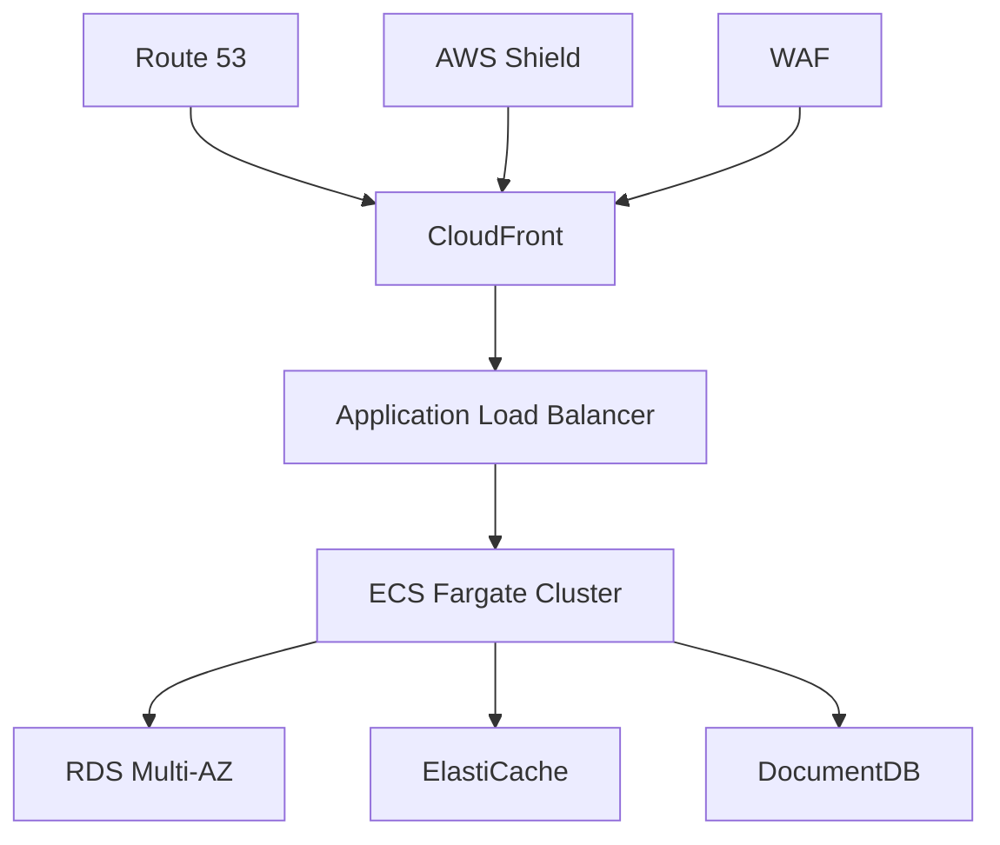

# SaaS Management Platform Infrastructure Documentation

## Table of Contents
- [Overview](#overview)
- [Prerequisites](#prerequisites)
- [Infrastructure Components](#infrastructure-components)
- [Environment Setup](#environment-setup)
- [Deployment Instructions](#deployment-instructions)
- [Monitoring and Maintenance](#monitoring-and-maintenance)
- [Security](#security)
- [Troubleshooting](#troubleshooting)
- [Disaster Recovery](#disaster-recovery)
- [Changelog](#changelog)

## Overview

### High-level Architecture
The SaaS Management Platform utilizes a highly available, multi-region AWS infrastructure designed for enterprise-grade reliability and scalability. The architecture implements Infrastructure as Code (IaC) using Terraform 1.5+ for consistent and repeatable deployments.

Key architectural components:
- Multi-AZ deployment across 3 availability zones
- Blue-green deployment capability
- Auto-scaling ECS clusters
- Multi-region DR configuration
- Centralized logging and monitoring

### AWS Services Overview
Primary services utilized:
- ECS Fargate (container orchestration)
- RDS PostgreSQL (primary database)
- DocumentDB (document storage)
- ElastiCache Redis (caching layer)
- CloudFront (CDN)
- Route 53 (DNS management)
- AWS Shield & WAF (security)

### Infrastructure Components


### Security Architecture
- Zero Trust security model
- AWS Shield for DDoS protection
- WAF rules for application security
- VPC security groups and NACLs
- AWS KMS for encryption management

### Monitoring Overview
- Prometheus for metrics collection
- Grafana for visualization
- CloudWatch for AWS service monitoring
- X-Ray for distributed tracing
- Custom alerting via PagerDuty

## Prerequisites

### Required Tools
- AWS CLI v2+
- Terraform >= 1.5
- Docker Desktop
- kubectl
- jq
- aws-vault (recommended)

### AWS Account Setup
1. Create an AWS Organization
2. Configure Service Control Policies
3. Set up Cross-Account IAM Roles
4. Enable AWS Organizations features:
   - Consolidated Billing
   - AWS Config
   - CloudTrail
   - GuardDuty

### IAM Permissions
Required IAM policies:
```json
{
  "Version": "2012-10-17",
  "Statement": [
    {
      "Effect": "Allow",
      "Action": [
        "ecs:*",
        "ec2:*",
        "rds:*",
        "elasticache:*",
        "s3:*",
        "route53:*",
        "cloudfront:*",
        "waf:*",
        "shield:*"
      ],
      "Resource": "*"
    }
  ]
}
```

## Infrastructure Components

### VPC and Networking
- CIDR: 10.0.0.0/16
- 3 public subnets
- 3 private subnets
- NAT Gateways in each AZ
- VPC Flow Logs enabled

### ECS Cluster Configuration
- Fargate launch type
- Auto-scaling groups
- Service discovery enabled
- Task definitions in JSON

### RDS Multi-AZ Setup
- PostgreSQL 15.x
- Instance class: r5.2xlarge
- Multi-AZ enabled
- Automated backups
- Performance Insights enabled

### ElastiCache Cluster
- Redis 7.x
- Cluster mode enabled
- Multi-AZ replication
- Encryption at rest

## Environment Setup

### Production (US-East-1)
```hcl
environment = "production"
region = "us-east-1"
availability_zones = ["us-east-1a", "us-east-1b", "us-east-1c"]
instance_type = "r5.2xlarge"
rds_instance_count = 2
redis_node_count = 3
```

### DR (US-West-2)
```hcl
environment = "dr"
region = "us-west-2"
availability_zones = ["us-west-2a", "us-west-2b"]
instance_type = "r5.xlarge"
rds_instance_count = 1
redis_node_count = 2
```

### Staging (US-East-2)
```hcl
environment = "staging"
region = "us-east-2"
availability_zones = ["us-east-2a", "us-east-2b"]
instance_type = "r5.large"
rds_instance_count = 1
redis_node_count = 1
```

## Deployment Instructions

### Initial AWS Setup
1. Configure AWS credentials
```bash
aws configure
# or
aws-vault add production
```

2. Initialize Terraform backend
```bash
terraform init -backend-config=environments/production/backend.hcl
```

3. Plan deployment
```bash
terraform plan -var-file=environments/production/terraform.tfvars
```

4. Apply infrastructure
```bash
terraform apply -var-file=environments/production/terraform.tfvars
```

### Application Deployment
1. Build containers
```bash
./scripts/build-containers.sh
```

2. Push to ECR
```bash
./scripts/push-containers.sh
```

3. Deploy services
```bash
./scripts/deploy-services.sh
```

## Monitoring and Maintenance

### Prometheus Setup
- Metrics retention: 15 days
- Scrape interval: 15s
- Alert manager integration
- Custom recording rules

### Grafana Dashboards
- Infrastructure Overview
- ECS Cluster Metrics
- RDS Performance
- Redis Metrics
- Application Metrics

### Backup Procedures
1. Database Backups
```bash
./scripts/backup.sh --type=rds
```

2. Configuration Backups
```bash
./scripts/backup.sh --type=config
```

## Security

### IAM Roles and Policies
- Service-specific roles
- Least privilege principle
- Regular rotation of credentials
- MFA enforcement

### Network Security
- VPC security groups
- NACLs
- WAF rules
- DDoS protection

## Troubleshooting

### Common Issues
1. Deployment Failures
   - Check CloudWatch Logs
   - Verify IAM permissions
   - Validate task definitions

2. Connectivity Issues
   - Verify security groups
   - Check route tables
   - Validate load balancer health checks

## Disaster Recovery

### Backup Strategy
- RDS automated backups
- Cross-region replication
- S3 versioning
- Regular DR drills

### Recovery Procedures
1. Database Failover
```bash
./scripts/failover.sh --region=us-west-2
```

2. Application Failover
```bash
./scripts/switch-traffic.sh --region=us-west-2
```

## Changelog

### Version 1.0.0 (2024-01-20)
- Initial infrastructure setup
- Multi-region deployment
- Monitoring stack implementation
- Security controls implementation

### Version 1.0.1 (2024-01-25)
- Enhanced WAF rules
- Improved backup procedures
- Updated monitoring dashboards
- Added performance optimization guidelines

---

**Note**: This documentation should be updated whenever infrastructure changes are made. All changes must go through security review and compliance validation.

For additional support, contact: devops@saasplatform.com