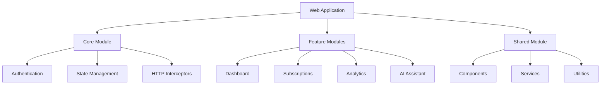

# SaaS Management Platform - Web Frontend

[](https://github.com/your-org/smp-web/actions)
[](https://coveralls.io/github/your-org/smp-web?branch=main)
[](https://angular.io/)
[](https://nodejs.org/)

## Overview

Enterprise-grade SaaS Management Platform frontend application built with Angular 17, providing comprehensive SaaS discovery, tracking, and optimization capabilities for SMBs.

### Key Features

- 🔍 AI-powered SaaS discovery dashboard
- 📊 Real-time usage analytics and reporting
- 💰 Cost optimization recommendations
- 🤖 Conversational AI assistant
- 🔐 Enterprise-grade security
- 📱 Responsive design for all devices

### Architecture



## Prerequisites

- Node.js 20.x LTS
- Angular CLI 17.x (`npm install -g @angular/cli@17`)
- Docker Desktop 24.x+
- VS Code with recommended extensions:
  - Angular Language Service
  - ESLint
  - Prettier
  - Docker
  - GitLens

### System Requirements

- Memory: 8GB RAM minimum, 16GB recommended
- Storage: 1GB free space
- OS: Windows 10/11, macOS 12+, or Linux
- Browser: Chrome 120+, Firefox 120+, Edge 120+

## Installation

1. Clone the repository:
```bash
git clone https://github.com/your-org/smp-web.git
cd smp-web
```

2. Install dependencies:
```bash
npm install
```

3. Configure environment:
```bash
cp .env.example .env
```

4. Verify installation:
```bash
npm run verify
```

### Troubleshooting

Common installation issues:

- **Node version mismatch**: Use `nvm` to switch to Node 20.x LTS
- **Port conflicts**: Check if ports 4200, 9876 are available
- **Memory issues**: Increase Node memory limit: `export NODE_OPTIONS=--max_old_space_size=8192`

## Development

### Development Server

```bash
npm start
```
Navigate to `http://localhost:4200/`. The app will automatically reload on source changes.

### Code Generation

```bash
# Generate component
ng generate component features/dashboard/widgets/usage-chart

# Generate service
ng generate service core/services/subscription

# Generate module
ng generate module features/analytics --routing
```

### State Management

- Uses NgRx for state management
- Follow container/presenter pattern
- Implement facade pattern for feature modules
- Use selectors for derived state
- Implement effects for side effects

### Code Style

- Follow Angular style guide
- Use TypeScript strict mode
- Implement SOLID principles
- Maximum cyclomatic complexity: 10
- Minimum 80% code coverage

## Project Structure

```
src/
├── app/
│   ├── core/                 # Singleton services, guards
│   ├── features/            # Feature modules
│   ├── shared/              # Shared components, pipes
│   └── shell/               # App shell components
├── assets/                  # Static assets
├── environments/            # Environment configurations
└── styles/                  # Global styles
```

### Module Architecture

- Core Module: Singleton services, guards, interceptors
- Feature Modules: Lazy-loaded feature components
- Shared Module: Reusable components, directives, pipes
- Shell Module: App shell and layout components

## Testing

### Unit Testing

```bash
# Run unit tests
npm test

# Generate coverage report
npm run test:coverage
```

Coverage requirements:
- Statements: 80%
- Branches: 80%
- Functions: 80%
- Lines: 80%

### E2E Testing

```bash
# Run e2e tests
npm run e2e

# Run e2e tests in CI mode
npm run e2e:ci
```

### Performance Testing

```bash
# Run lighthouse audit
npm run audit

# Run bundle analysis
npm run analyze
```

## Deployment

### Production Build

```bash
# Production build
npm run build:prod

# Analyze bundle
npm run analyze:prod
```

### Environment Configuration

- `environment.ts`: Development environment
- `environment.staging.ts`: Staging environment
- `environment.prod.ts`: Production environment

### CI/CD Integration

- GitHub Actions for CI/CD
- Automated testing on PR
- Automated deployment to staging
- Manual promotion to production
- Automated rollback capability

## Contributing

### Branch Strategy

- `main`: Production-ready code
- `develop`: Development branch
- `feature/*`: New features
- `bugfix/*`: Bug fixes
- `release/*`: Release preparation

### Commit Convention

Follow Angular commit message convention:
```
<type>(<scope>): <subject>

<body>

<footer>
```

Types:
- feat: New feature
- fix: Bug fix
- docs: Documentation
- style: Formatting
- refactor: Code restructuring
- test: Tests
- chore: Build tasks

### Pull Request Process

1. Create feature/bugfix branch
2. Implement changes with tests
3. Update documentation
4. Submit PR with description
5. Pass CI checks
6. Get code review approval
7. Squash and merge

### Code Review Checklist

- [ ] Follows style guide
- [ ] Includes tests
- [ ] Updates documentation
- [ ] Maintains/improves performance
- [ ] Implements security best practices
- [ ] Handles errors appropriately
- [ ] Includes accessibility features

## License

Copyright © 2024 Your Organization. All rights reserved.